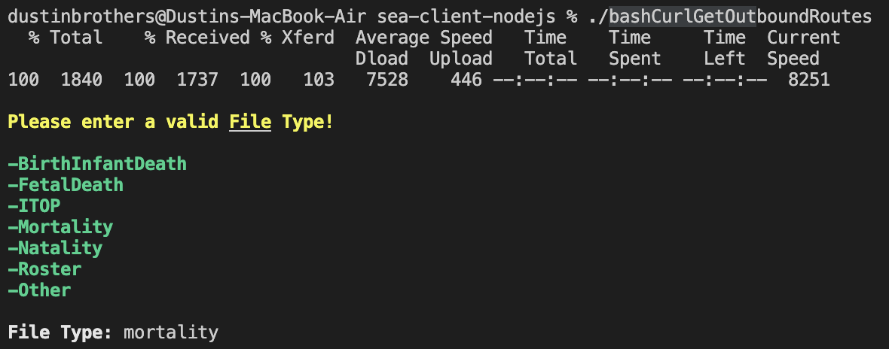
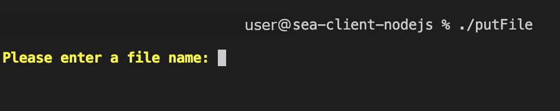
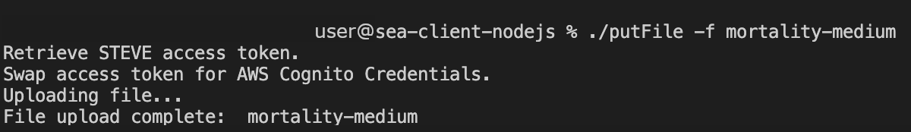

# Bash Functions

These functions are meant to simplify testing and automation for the user based upon the already written nodejs functions and predefined cURL commands. They replace the need to use the Swagger UI and further enable the user to programmatically send and download files as well as list mailboxes, outbound routes and mailbox messages.

---

## Sending Files

You will first need to open a transaction using an outbound route within the `clientResourcesFolder/outboundRoutes.json` file located in this repo. <span style="color:#3b98bf">**Both the `clientResourcesFolder` folder and `outboundRoutes.json` file will be created for you upon running the below commands.**</span>

### Get Outbound Routes

>Before opening a transaction using the prompt you will need to create an `outboundRoutes.json` file by running one of the below commands. <span style="color:#dde00d">If you are opening a transaction without the prompt and already have the needed information for the file type you will be opening a transaction for, you will not need to run either of the get outbound routes commands.</span>

**Get outbound routes for sending file with prompt:**

>If you run this command you will be prompted for the needed information to get outbound routes. A `clientResourcesFolder` folder will be created within this repo and your outbound routes for the chosen file type will be sent to `clientResourcesFolder/outboundRoutes.json`. 

><span style="color:#3b98bf">NOTE:</span> The `clientResourcesFolder` folder is automatically created if one does not exist upon running this command.

<br />

<br />

```
./curlGetOutboundRoutes
```

<br />

<br />



<br />

<br />

>After entering the desired file type and hitting enter you should see the below response in which you can press <span style="color:#3b98bf">&#8984;+click</span> or <span style="color:#3b98bf">Ctrl+click</span> depending on what OS you are using to open the file at the displayed link.

<br />

<br />

<center>


</center>

<br />

<br />

<center>


</center>

<br />

<br />

**Get outbound routes for sending file without prompt:**

>If running this command you will need to follow the `-f` option with a valid file type as listed below: 

- <span style="color:#0f945c"> BirthInfantDeath </span>
- <span style="color:#0f945c"> FetalDeath </span>
- <span style="color:#0f945c"> ITOP </span>
- <span style="color:#0f945c"> Mortality </span>
- <span style="color:#0f945c"> Natality </span>
- <span style="color:#0f945c"> Roster </span>
- <span style="color:#0f945c"> Natality </span>

>Once this command has ran a `clientResourcesFolder` folder will be created within this repo and your outbound routes for the chosen file type will be sent to `clientResourceFolder/outboundRoutes.json`. You will also receive a success response and be able to <span style="color:#3b98bf">&#8984;+click</span> or <span style="color:#3b98bf">Ctrl+click</span> depending on what OS you are using to open the file at the displayed link.

><span style="color:#3b98bf">NOTE:</span> The `clientResourcesFolder` folder is automatically created if one does not exist upon running this command.

<br />

<br />

```
./curlGetOutboundRoutes -f <fileType>
```

<br />

<br />

<center>


</center>

<br />

<br />

### Open Transaction

>After your outbound routes file has be generated you will have the needed outbound IDs to open a transaction.

**Open Transaction with prompt:**

>If you run this command you will be prompted for the needed information to open a transaction. <span style="color:#e8640c">If you run this command in this manner without options and do not have an `ouboundRoutes.json` file in the `clientResourcesFolder` folder it will prompt you to create one and exit the script.</span> The file name will be what you decided to name the file when sent (e.g. myTestFile.MOR, myTestFile.NAT, etc.). The file type will be the file type of the file that you will be sending (e.g. Mortality, FetalDeath, ITOP, etc.). The path to the current oubound route file for the file type that you last specified when running one of the `./getOutboundRoutes` commands will be displayed in the prompt and you can either can press <span style="color:#3b98bf">&#8984;+click</span> or <span style="color:#3b98bf">Ctrl+click</span> depending on what OS you are using to open the file at the displayed link and copy the `outboundId` for the routes that you intend to send to. 

<br />

<center>


</center>

<br />

>With this command you can send to one outbound route or as many valid outbound routes as you need without having to run the command for each outbound route.<span style="color:#e8640c"> Be sure to seperate the outboundIds with spaces as shown below when using more than one outboundId without any leading or trailing spaces.</span>

<br />

<br />

```
./curlOpenTransaction
```
<br />

<br />


<br /> 

<br />

><span style="color:#0f945c;font-weight:bold">Once transaction is opened successfully you will see the message below with a unique transaction ID.</span>

<br /> 

<br />


<br /> 

<br />

**Open Transaction without prompt:**

>If you run this command it is assumed that you already know the proper information to open a transaction. The file name will be what you decided to name the file when sent (e.g. myTestFile.MOR, myTestFile.NAT, etc.). The file type will be the file type of the file that you will be sending (e.g. Mortality, FetalDeath, ITOP, etc.). With this command you can also send to one outbound route or as many valid outbound routes as you need without having to run the command for each outbound route.<span style="color:#e8640c"> Be sure to seperate the outboundIds with spaces as shown below when using more than one outboundId without any leading or trailing spaces.</span>
<br />

<br />

```
./curlOpenTransaction -o <outboundIds> -f <fileName> -t <fileType>
```
<br /> 

<br />

><span style="color:#0f945c;font-weight:bold">Once transaction is opened successfully you will see the message below with a unique transaction ID.</span>

<br /> 

<br />


<br /> 

<br />

**Sending files with prompt:**

>If you run this command you will be prompted for the needed information to send a file to the outbound route/s that were used when opening the transaction. You can use one of the files from `files/outbound/` within this repo or add a file of your own to `files/outbound/` and send it. <span style="color:#e8640c">If the files/outbound/ directory does not exist or there are no files to send in the outbound files directory a error will be thrown.</span>

<br /> 

<br />

```
./putFile
```

<br /> 

<br />



<br /> 

<br />

><span style="color:#0f945c;font-weight:bold">You will see the responses below for the file that you specified to send when file is successfully sent.</span>

<br /> 

<br />


<br /> 

<br />

**Sending files without prompt:**

>If you run this command you will need to use the `-f` option followed by the file name of the file you want to send to the outbound route/s that were used when opening the transaction.

<br /> 

<br />

```
./putFile -f <fileName>
```

<br /> 

<br />

><span style="color:#0f945c;font-weight:bold">If the file is successfully sent you will see the below response.</span>

<br /> 

<br />



<br /> 

<br />

**Close Transaction:**

>After a file has been sent you will need to close the transaction before the file will appear in the mailboxes of the outbound routes the files were sent. You will only be able to close a transaction once a file has been sent.

<br /> 

<br />

```
./closeTransaction
```
<br /> 

<br />

><span style="color:#0f945c;font-weight:bold">Once the transaction has been closed you will see the below response.</span>

<br /> 

<br />


<br /> 

<br />

### Getting Unread Messages and Date Ranged Messages

These commands will be used to retrieve unread messages and date ranged messages. Before getting unread messages or date ranged messages you will need a `mailboxList.json` file which contains all of the mailboxes that are attached to your client along with all of their respective mailbox IDs. These ids will be used to pull unread or date ranged messages. The `mailboxList.json` file will be within this repo in the `clientResourcesFolder` folder and if a `clientResourcesFolder` folder does not exist it will be created automatically. All of this will be done using the commands below.<span style="color:#dde00d"> If you already have the needed information for getting unread or date ranged messages without the prompts you will not need to run the create mailbox list command.</span>

**Creating a mailbox list json file**

>This command will create the needed `mailboxList.json` file. Nothing will be needed when running this command it will automatically pull the mailboxes that are attached to the current client that you are using and create a `clientResourcesFolder` to contain the file if the folder does not already exist. The path to the `mailboxList.json` file for the mailboxes that are attached to your client will be displayed in the terminal and you can either <span style="color:#3b98bf">&#8984;+click</span> or <span style="color:#3b98bf">Ctrl+click</span> depending on what OS you are using to open the file at the displayed link and copy the `mailboxId` for the mailbox that you want to pull unread or date ranged messages. 

><span style="color:#3b98bf">NOTE:</span> The `clientResourcesFolder` folder is automatically created if one does not exist upon running this command.

<br /> 

<br />

```
./createMailboxListJSONFile
```

<br /> 

<br />

><span style="color:#0f945c;font-weight:bold">When the transaction runs successfully you will see the below response along with the creation of the `mailboxList.json` file.</span>

<br /> 

<br />

<center>


</center>

<br /> 

<br />

**Get unread messages with prompt**

>This command will pull all unread messages with a limit of 100 messages for a mailbox. You will be prompted for the mailbox id for pulling unread messages.<span style="color:#e8640c"> If a `mailboxList.json` file does not exist you will be prompted to create one and the script will exit.</span>

><span style="color:#3b98bf">NOTE:</span> The `clientResourcesFolder` folder is automatically created if one does not exist upon running this command.

<br /> 

<br />

```
./curlGetUnread
```

<br /> 

<br />

><span style="color:#0f945c;font-weight:bold">When the command runs successfully you will see the below responses which will contain a link that you can either <span style="color:#3b98bf">&#8984;+click</span> or <span style="color:#3b98bf">Ctrl+click</span> depending on what OS you are using to open the `unreadMessages.json` file at the displayed link.</span>

<br /> 

<br />

<center>


</center>

<br /> 

<br />

**Get unread messages without prompt**

>This command will pull all unread messages with a limit of 100 messages for a mailbox. When running with the `-m` you will not need to have a mailboxList.json file since you already have a mailbox ID.<span style="color:#3b98bf"> This command will create a `clientResourceFolder` folder to contain the `unreadMessages.json` file if one does not already exist.</span>

><span style="color:#3b98bf">NOTE:</span> The `clientResourcesFolder` folder is automatically created if one does not exist upon running this command.

<br /> 

<br />

```
./curlGetUnread -m <mailboxId>
```

<br /> 

<br />

><span style="color:#0f945c;font-weight:bold">When the command runs successfully you will see the below responses which will contain a link that you can either <span style="color:#3b98bf">&#8984;+click</span> or <span style="color:#3b98bf">Ctrl+click</span> depending on what OS you are using to open the `unreadMessages.json` file at the displayed link.</span>

<br /> 

<br />

<center>


</center>

<br /> 

<br />

**Getting unread messages using `./curlGetUnread2`**

>The below commands do the exact same thing as the `./curlGetUnread` command `./curlGetUnread2` just uses the `/inbound/<mailboxId>` route rather than the `/files/<mailboxId>` route.

><span style="color:#3b98bf">NOTE:</span> The `clientResourcesFolder` folder is automatically created if one does not exist upon running these commands.

<br /> 

<br />

```
./curlGetUnread2
```

<br /> 

<br />

<br /> 

<br />

```
./curlGetUnread2 -m <messageId>
```

<br /> 

<br />

**Getting messages from within a date range with prompt**

>This command allows you to get messages within a specific date range using <span style="color:#dde00d">From</span> and <span style="color:#dde00d">To</span> dates with the following date format <span style="color:#dde00d">yyyy-mm-dd</span>.<span style="color:#e8640c"> The earliest possible date you can get messages for the client is from time the client was created. You can not pull messages from any earlier.</span> It also allows you to pick between three statuses <span style="color:#dde00d">all</span>, <span style="color:#dde00d">read</span> and <span style="color:#dde00d">unread</span>. <span style="color:#e8640c">If you run this command without a `mailboxList.json` file it will assume that you do not have the needed mailbox ID and will prompt you to run the command to create the file and exit.</span>

><span style="color:#3b98bf">NOTE:</span> The `clientResourcesFolder` folder is automatically created if one does not exist upon running this command.

<br /> 

<br />

```
./getMessagesByDateRange
```

<br /> 

<br />

><span style="color:#0f945c;font-weight:bold">You will be prompted once the command runs after entering the correct information and it will let you know that a limit of 100 messages will be displayed for the specified date range and to enter a more narrow timeframe if you are looking for a specific message. Once you press `Enter/Return` to continue a file will be created in the `clientResourcesFolder` folder named by the date range that you chose ending in messages (e.g. `2023-01-01_to_2023-01-17_messages.json`). It will display a link in which you can either <span style="color:#3b98bf">&#8984;+click</span> or <span style="color:#3b98bf">Ctrl+click</span> depending on what OS you are using to open the date ranged file at the displayed link.</span>

<br /> 

<br />

<center>


</center>

<br /> 

<br />

**Getting messages from within a date range without prompt and no `-p` pass warning option**

>This command also allows you to get messages within a specific date range using <span style="color:#dde00d">From</span> and <span style="color:#dde00d">To</span> dates with the following date format <span style="color:#dde00d">yyyy-mm-dd</span>.<span style="color:#e8640c"> The earliest possible date you can get messages for the client is from time the client was created. You can not pull messages from any earlier.</span> It also allows you to pick between three statuses <span style="color:#dde00d">all</span>, <span style="color:#dde00d">read</span> and <span style="color:#dde00d">unread</span>.<span style="color:#dde00d"> No `mailboxList.json` file will be required to run this command as long as you enter a valid mailbox ID.</span>

><span style="color:#3b98bf">NOTE:</span> The `clientResourcesFolder` folder is automatically created if one does not exist upon running this command.

<br /> 

<br />

```
./getMessagesByDateRange -m <mailboxId> -f <fromDate> -t <toDate> -s <status>
```

<br /> 

<br />

><span style="color:#0f945c;font-weight:bold">You will be prompted once the command runs after entering the correct information and it will let you know that a limit of 100 messages will be displayed for the specified date range and to enter a more narrow timeframe if you are looking for a specific message. Once you press `Enter/Return` to continue a file will be created in the `clientResourcesFolder` folder named by the date range that you chose ending in messages (e.g. `2023-01-01_to_2023-01-17_messages.json`). It will display a link in which you can either <span style="color:#3b98bf">&#8984;+click</span> or <span style="color:#3b98bf">Ctrl+click</span> depending on what OS you are using to open the date ranged file at the displayed link.</span>

<br /> 

<br />

<center>


</center>

<br /> 

<br />

**Getting messages from within a date range without prompt and `-p` pass warning option**

>There is no difference in this variation of the command other than it passes the warning at the end of the script. The `-p` option was added to remove any possible stops the prompt may cause with a written program.

><span style="color:#3b98bf">NOTE:</span> The `clientResourcesFolder` folder is automatically created if one does not exist upon running this command.

<br /> 

<br />

<center>


</center>

<br /> 

<br />

**Downloading files with prompt**

>When you run this command you must have an `unreadMessages.json` or a `date ranged message file` in your `clientResourcesFolder` or you will be prompted to create one and the script will exit. Once you have an `unreadMessages.json` file or a `date ranged JSON message file` in your `clientResourcesFolder` you will be prompted for the message ID of the file you would like to download.

><span style="color:#3b98bf">NOTE:</span> An `inbound` folder is automatically created if one does not exist upon running this command.

<br /> 

<br />

```
./downloadFile
```

<br /> 

<br />

><span style="color:#0f945c;font-weight:bold">When the command has run successfully you will see the file downloaded into your inbound folder and be able to either <span style="color:#3b98bf">&#8984;+click</span> or <span style="color:#3b98bf">Ctrl+click</span> depending on what OS you are using to open the downloaded file at the displayed link.</span>
>You will also be asked if you would like to mark the file read in which you can enter <span style="color:#dde00d">y</span> for yes or <span style="color:#dde00d">n</span> for no. If you enter <span style="color:#dde00d">n</span> for no a command will be displayed for you to be able to mark the file read in the future.

<br /> 

<br />

<center>


</center>

<br /> 

<br />

**Downloading files without prompt and do not mark file read**

><span style="color:#0f945c;font-weight:bold">Running this command with only the `-m` option followed by the `messageId` will skip the yes or no prompt but still give you the command to mark the file as read in the future.</span>

><span style="color:#3b98bf">NOTE:</span> An `inbound` folder is automatically created if one does not exist upon running this command.

<br /> 

<br />

```
./downloadFile -m <messageId>
```

<br /> 

<br />

><span style="color:#0f945c;font-weight:bold">When this command has ran successfully you will see a display link to the file that you downloaded. You can either <span style="color:#3b98bf">&#8984;+click</span> or <span style="color:#3b98bf">Ctrl+click</span> depending on what OS you are using to open the downloaded file at the displayed link.</span> . There will also be a command displayed that you can use to mark that specific message as read in the future.</span>

<br /> 

<br />

<center>


</center>

<br /> 

<br />

**Downloading files without prompt and mark file read**

>Running this command with only the `-m` option followed by the `messageId` and the `-r` option following the `messageId` will mark the file as read after downloading the message.

><span style="color:#3b98bf">NOTE:</span> An `inbound` folder is automatically created if one does not exist upon running this command.

<br /> 

<br />

```
./downloadFile -m <messageId> -r
```

<br /> 

<br />

><span style="color:#0f945c;font-weight:bold">When this command has ran successfully you will see a display link to the file that you downloaded. You can either <span style="color:#3b98bf">&#8984;+click</span> or <span style="color:#3b98bf">Ctrl+click</span> depending on what OS you are using to open the downloaded file at the displayed link. It will also be displayed that this file has been marked as read.</span>

<br /> 

<br />

<center>


</center>

<br /> 

<br />

**Mark file as read with prompt**

>When running this you will be prompted for the needed messageId of the file you will be marking as read.

<br /> 

<br />

```
./markAsRead
```

<br /> 

<br />

><span style="color:#0f945c;font-weight:bold">If this command runs successfully you will see the below response.</span>

<br /> 

<br />

<center>


</center>

<br /> 

<br />

**Mark file as read with prompt**

>When running this command you will need to follow the `-m` option with the `messageId`.

<br /> 

<br />

```
./markAsRead -m <messageId>
```

<br /> 

<br />

><span style="color:#0f945c;font-weight:bold">If this command runs successfully you will see the below response.</span>

<br /> 

<br />

<center>


</center>

<br /> 

<br />